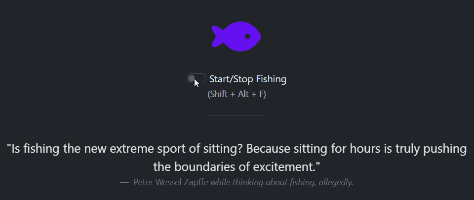

# Welcome to The Elder Scrolls Online Fish Master 3000 documentation

<figure markdown="span">
  
  <figcaption></figcaption>
</figure>

!!! warning
    **The Elder Scrolls Online Fish Master 3000** is a proof of concept and should be used at your own risk. [The Elder
    Scrolls Online EULA](https://account.elderscrollsonline.com/en-us/eula) prohibits the use of third-party programs to automate gameplay:

    > use cheats, automation software (bots), hacks, mods or any other unauthorized third-party software designed to modify
    > the Game or adversely impact any other persons playing of the Game or his/her experience of playing the Game;

    While you are not "modifying the game" (this app does not read or write data to or from The Elder Scrolls Online's
    servers) or "adversely impacting" other players by automating the fishing process, you might still be considered in
    violation the EULA by using this program.  

    **Use this program at your own risk.**

## Concept

**The Elder Scrolls Online Fish Master 3000** uses the following concept to automate the fishing process in the game
"The Elder Scrolls Online":

1. Thanks to [Votan's Fisherman](https://www.esoui.com/downloads/info918-VotansFisherman.html) plugin, the game plays a
   sound effect when a fish bites the hook.
2. The sound effect is recorded by the computer's audio input device.
3. The recorded audio data is analyzed in real-time to detect the sound effect.
4. When the sound effect is detected, a keyboard key is simulated to reel in the fish.
5. The process is repeated until all fish are caught and the fishing hole is depleted.

Easy, right? Want to know more? Check our [Get started](./setup.md) guide to get going.
