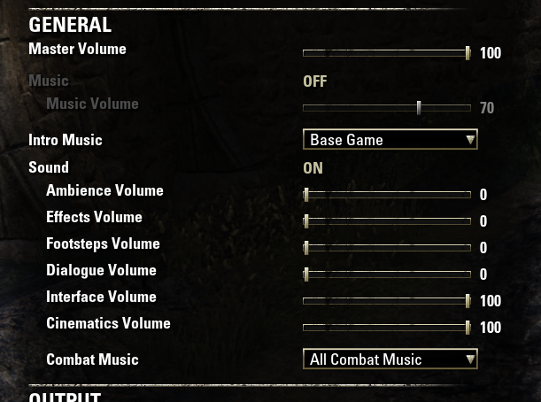
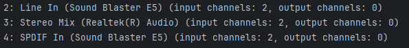
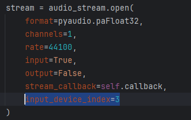

# Get Started

Before you can use **The Elder Scrolls Online Fish Master 3000**, you need to install the required software and set up
the environment.

Follow these steps carefully to ensure that everything is set up correctly.

## 1. Prerequisites

**The Elder Scrolls Online Fish Master 3000** requires the following software to be installed:

1. [Python 3.8.5](https://www.python.org/downloads/release/python-385/) or newer and any required libraries.
2. [Votan's Fisherman](https://www.esoui.com/downloads/info918-VotansFisherman.html) add-on for The Elder Scrolls Online
3. A sound file of the fishing sound effect from the _Votan's Fisherman_ plugin (one is included in the repository)

!!! Note
    We are not covering the Python installation process in this guide. If you need help installing Python, check
    the [official Python installation guide](https://docs.python.org/3/using/index.html). The same applies to the libraries'
    installation; see pip's [official guide](https://pip.pypa.io/en/stable/installation/).

## 2. Set up the environment

Before you can go fishing, there is a little bit of setup to do. First you must make sure this app can detect the sound
of a fish biting the hook, and then you must make sure no other sound is interfering with the detection. Here's how to
do it:

1. In The Elder Scrolls Online, **Turn off the in-game music and extra sound effects**. It will make the sound detection
   more accurate.
    <figure markdown="span">
      
      <figcaption>Advised sound settings</figcaption>
    </figure>
   2. In The Elder Scrolls Online, activate the Votan's Fisherman plugin and go to `Addons` > `Fisherman` > `Reel In - Event` > `Sound` and select "Justice Pickpocket Failed" from the dropdown menu. This sound is the default sound that triggers this app.
       <figure markdown="span">
         
         <figcaption>Votan's Fisherman settings</figcaption>
       </figure>

   !!! NOTE "Using a different sound"
   If you want to use a different sound to trigger the Fish Master 3000, you must then place the sound file in the same
   directory as the `sound_detector.py` script and set the `sound_file_path` variable to the path of the sound file.
   See "Advanced settings" on this page for more information.

2. Make sure the "Stereo Mix" feature that is available on many Windows systems is active:
    1. For Windows 11, right-click on the speaker icon in the system tray and select "Sound Settings."
    2. Open the "All sound devices" tab.
    3. Click on "Stereo Mix" and select "Allow apps and Windows to use this device for audio."
       See the image below for reference.
       <figure markdown="span">
           
           <figcaption>Stereo Mix in Windows 11</figcaption>
       </figure>

3. Execute the `list_audio_devices.py` script to list the available audio input devices. This script will output a list
   of available audio input devices and their respective indices (a sort of ID number) in the terminal. Take note of the
   index of the "Stereo Mix" input device you want to use for sound detection.
    <figure markdown="span">
           
           <figcaption>In this case the index is "3"</figcaption>
    </figure>
4. Open the `sound_detector.py` script and set the `input_device_index` variable to the index of the audio input device
   you want to use for sound detection.
    <figure markdown="span">
        
        <figcaption>`input_device_index` set to "3"</figcaption>
    </figure>

## 3. Run The Elder Scrolls Online Fish Master 3000

Now that you have set up the best possible environment for the Fish Master 3000, you can start fishing. **Check
the [howto.md](./howto.md) guide to get going!**

## Advanced settings

The Fish Master 3000 comes with a default configuration that should work for most users. However, you can customize the
Fish Master 3000 to your liking if you are familiar with Python.
This way you can shave off a few milliseconds from the fishing process and catch fish faster, or make the app less
sensitive to sound if you are getting too many false positives. Here's how to do it:

- Define the path to the sound file to detect in the `sound_file_path` variable if you chose a different sound.
- Adjust the threshold variable `DETECTION_THRESHOLD` to set the minimum correlation value required for the sound file
  to be detected. The lower, the more sensitive.
- Adjust the `MINIMUM_INTERVAL_BETWEEN_DETECTIONS` variable to set the minimum time between sound file detections.
- Adjust the `MINIMUM_INTERVAL_BETWEEN_KEY_PRESSES` variable to set the minimum time between keyboard key presses.
- Adjust the `DELAY_TIME_LOWER_BOUND` and `DELAY_TIME_UPPER_BOUND` variables to set the pause time after the first
  keyboard key press.